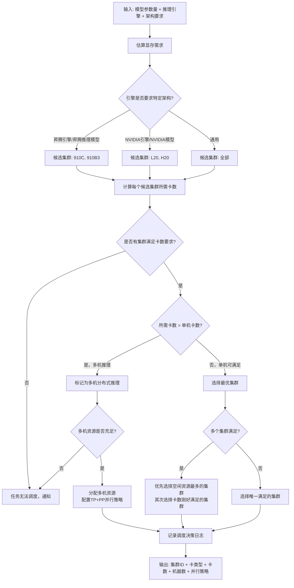

### 调度策略设计

#### 集群资源清单

| 集群ID | 架构 | 卡型号 | 单卡显存 | 机器数 | 总卡数 | 适用场景 |
|---|---|---|---:|---:|---:|---|
| ascend-910c | ARM | 昇腾910C | 128GB HBM | 2台 | 16卡 | 昇腾生态大模型 |
| ascend-910b3 | ARM | 昇腾910B3 | 64GB HBM | 2台 | 16卡 | 昇腾生态中小模型 |
| nv-120 | x86 | L20 | 48GB GDDR | 4台 | 32卡 | NVIDIA生态通用 |
| nv-h20 | x86 | H20 | 96GB HBM | 1台 | 8卡 | NVIDIA生态大模型 |

---

#### 模型大小 -> 卡数映射策略

- **核心公式**：所需卡数 = `ceil(模型显存需求 / 单卡可用显存)`
- **模型显存需求估算（BF16精度）**：显存需求(GB) = 参数量(B) × 2 × 1.2（1.2为KV Cache和运行时开销系数）

| 模型参数量 | 显存需求估算(BF16) | L20(48GB)卡数 | H20(96GB)卡数 | 910C(128GB)卡数 | 910B3(64GB)卡数 |
|---|---:|---:|---:|---:|---:|
| <7B | ~17GB | 1卡 | 1卡 | 1卡 | 1卡 |
| 8B~14B | ~34GB | 1卡 | 1卡 | 1卡 | 1卡 |
| 15B~32B | ~77GB | 2卡(TP) | 1卡 | 1卡 | 2卡(TP) |
| 33B~72B | ~173GB | 4卡(TP) | 2卡(TP) | 2卡(TP) | 4卡(TP) |
| 73B~140B | ~336GB | 8卡(TP) | 4卡(TP) | 4卡(TP) | 8卡(TP) |
| 141B~280B | ~672GB | 需多机(TP+PP) | 8卡(TP) | 8卡(TP) | 需多机(TP+PP) |
| >280B | >672GB | 需多机(TP+PP) | 需多机(TP+PP) | 需多机(TP+PP) | 需多机(TP+PP) |

---

#### 调度决策流程



---

#### 并行策略选择

| 卡数 | 并行策略 | 说明 |
|---:|---|---|
| 1卡 | 无并行 | 单卡推理 |
| 2~8卡(单机) | TP(Tensor Parallelism) | 张量并行，同一机箱内 |
| >8卡(多机) | TP + PP(Pipeline Parallelism) | 张量并行 + 流水线并行，跨机箱；如2×910c(128GB)可支持~248B模型 |

---

#### 多机分布式推理说明

当模型显存需求超过单机容量时（如超大模型需要>8卡），需要跨机分布式推理：

- **910C集群**：2台×8=16卡，单机128GB×8=1024GB，双机可支持最大~2048GB显存需求
- **910B3集群**：2台×8=16卡，单机64GB×8=512GB，双机可支持最大~1024GB显存需求
- **L20集群**：4台×8=32卡，可支持更大规模分布式推理
- **多机场景需配置节点间通信**（昇腾HCCL/NVIDIA NCCL），可能需要人工介入

---

#### 调度决策日志示例

```json
{
  "timestamp": "2026-03-01T10:30:00Z",
  "model_id": "Qwen/Qwen3-72B",
  "model_params": "72B",
  "estimated_memory_gb": 173,
  "engine": "vllm",
  "architecture": "any",
  "decision": {
    "cluster_id": "nv-120",
    "gpu_type": "L20",
    "gpu_count": 4,
    "parallelism": "TP",
    "reason": "72B模型需要~173GB显存，L20(48GB)×4=192GB满足需求，L20集群空闲资源充足"
  }
}
```

