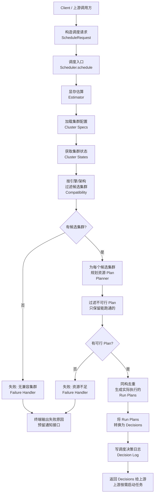

### 调度代码大纲流程图（粗略版）

> 说明：这是在详细流程的基础上抽象出来的“代码大纲级”流程图，只保留主要步骤和关键模块，方便快速理解整体结构。

```mermaid
flowchart TD
  A[Client / 上游调用方] --> B[构造调度请求\nScheduleRequest]
  B --> C[调度入口\nScheduler.schedule]

  C --> D[显存估算\nEstimator]
  D --> E[加载集群配置\nCluster Specs]
  E --> F[获取集群状态\nCluster States]

  F --> G[按引擎/架构\n过滤候选集群\nCompatibility]
  G --> H{有候选集群?}
  H -->|否| X1[失败: 无兼容集群\nFailure Handler]
  H -->|是| I[为每个候选集群\n规划资源 Plan\nPlanner]

  I --> J[过滤不可行 Plan\n只保留能跑通的]
  J --> K{有可行 Plan?}
  K -->|否| X2[失败: 资源不足\nFailure Handler]
  K -->|是| L[同构去重\n生成实际执行的\nRun Plans]

  L --> M[将 Run Plans\n转换为 Decisions]
  M --> N[写调度决策日志\nDecision Log]
  N --> O[返回 Decisions 给上游\n上游按需启动任务]

  X1 --> Y[终端输出失败原因\n预留通知接口]
  X2 --> Y
```

---

如果你后续觉得这个大纲还需要再精简（比如去掉显存估算细节、把“集群配置+状态”合并成一个“资源视图”节点），我可以再帮你出一个“极简版”的流程图，专门给产品/非技术同学看。 
