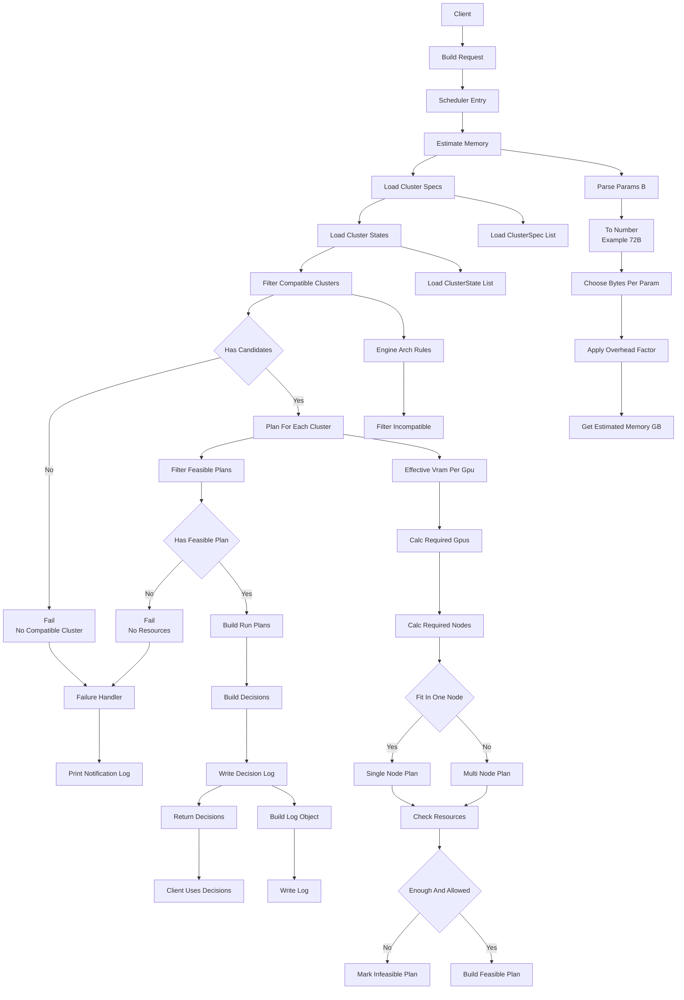

### 智能资源调度代码整体流程图

> 说明：本流程图基于 `params_b` 使用模型官方参数量，展示从外部请求到决策输出的完整代码调用链路。为兼容 Mermaid 预览，对节点文案做了简单化（使用 ` ` 换行，避免 `->` 等特殊符号）。

---

### 流程图中各模块功能说明

- **Client / Build Request (`A`, `B`)**
  - **功能**：由外部调用方（CLI、HTTP API、SDK 等）根据上游业务参数构造一个标准化的 `ScheduleRequest` 对象。
  - **典型字段**：`model_id`、`model_params_b`（官方参数量）、`engine`、`arch_requirement`、可选调度 hint（如强制单机、多机关闭等）。

- **Scheduler Entry (`C`)**
  - **功能**：调度器的统一入口函数，例如 `Scheduler.schedule(request)`。
  - **职责**：串联后续所有步骤（显存估算、资源加载、兼容性过滤、规划、日志）并返回最终决策结果。

- **Estimate Memory (`S1` 及 `E1a`–`E1e`)**
  - **功能**：基于 `model_params_b` 和精度（默认 BF16）估算模型推理所需显存。
  - **主要逻辑**：
    - 解析官方参数量（例如 `"72B"` → `72 * 1e9`）。
    - 按精度选定每个参数字节数（如 BF16 = 2 bytes）。
    - 乘以开销系数 `overhead_factor`（默认 1.2）并转为 GB。

- **Load Cluster Specs (`S2`, `I1`)**
  - **功能**：加载静态的集群规格配置（通常来源于配置文件，如 `clusters.yaml`）。
  - **典型字段**：`cluster_id`、`vendor`（ascend/nvidia）、`arch`（arm/x86）、`gpu_type`、`vram_gb`、`nodes`、`gpus_per_node`、标签等。
  - **职责**：提供“理论上能干什么”的能力边界。

- **Load Cluster States (`S3`, `I2`)**
  - **功能**：获取当前各集群的动态资源状态。
  - **典型字段**：`cluster_id`、`free_gpus`、`free_nodes`、`health`、`maintenance` 标记等。
  - **职责**：反映“现在具体还能干多少”，为后续资源校验提供数据。

- **Filter Compatible Clusters (`S4`, `C1`, `C2`)**
  - **功能**：根据 `engine` 和 `arch_requirement` 应用兼容性规则，筛选出可运行该任务的集群。
  - **示例规则**：昇腾引擎只选 `vendor=ascend`，NVIDIA 引擎只选 `vendor=nvidia`，通用则可使用所有符合架构要求的集群。
  - **结果**：得到一个候选 `ClusterSpec` 列表，后续只在这些集群上做规划。

- **Plan For Each Cluster / Planner (`S6`, `P1`–`P10`)**
  - **功能**：对每个候选集群生成一份资源使用计划（Plan）。
  - **主要逻辑**：
    - 计算单卡可用显存：`effective_vram_gb = vram_gb * ratio`（考虑保留和碎片）。
    - 计算所需卡数：`required_gpus = ceil(estimated_memory_gb / effective_vram_gb)`。
    - 计算所需节点数：`required_nodes = ceil(required_gpus / gpus_per_node)`。
    - 判断单机/多机：若 `required_gpus <= gpus_per_node` → 单机计划，否则多机计划。
    - 分配并行策略：单机时选 NONE/TP，多机时选 TP+PP 并标记 `multi_node = true`。
    - 校验资源是否充足（`free_gpus`、`free_nodes`、`health` 等），生成可行或不可行的 Plan。

- **Filter Feasible Plans (`S7`, `P9`, `P10`)**
  - **功能**：从所有 Plan 中筛选出 `is_feasible = true` 的方案。
  - **职责**：剔除资源不足、多机不允许、处于维护状态等不满足条件的候选，得到“所有能跑得通的方案”列表。

- **Build Run Plans / Build Decisions (`S10`, `S11`)**
  - **功能**：在所有可行 Plan 中，按照“同构只保留一份、不同构都保留”的规则生成实际要执行的 Plan 列表，并为每个 Plan 转成标准化的 `Decision` 对象。
  - **输出内容**：一个 `Decision` 数组，每个元素包含 `cluster_id`、`gpu_type`、`gpu_count`、`node_count`、`parallelism`、是否多机、以及补充 flag（如 `needs_manual_intervention`）；同构集群的重复方案只会出现一次。

- **Write Decision Log (`S12`, `L1`, `L2`)**
  - **功能**：将本次调度的输入、显存估算结果、最终决策和原因写入日志。
  - **作用**：便于追踪调度行为、排查问题、做后续调参优化（类似文档中的 JSON 示例）。

- **Return Decisions (`S13`, `Z`)**
  - **功能**：将所有需要实际执行的 `Decision` 列表返回给上层调用方，由其决定在每个不同构集群上分别启动任务。
  - **可能动作**：在每种不同构集群上各跑一次、对同构集群复用同一个配置、或根据业务策略挑选其中一部分执行。

- **Failure Handler / Notification Placeholder (`E1`, `E2`, `F1`, `F2`)**
  - **功能**：统一处理调度过程中的失败场景，例如“无兼容集群”“资源不足”等。
  - **当前实现**：不直接发送 App 通知，而是通过在终端输出结构化日志（如错误码、原因、建议）来模拟通知行为，方便开发调试。
  - **预留扩展**：后续可以在 `Failure Handler` 内替换为真正的通知接口（如调用消息推送服务、Webhook、IM 机器人等），而无需改动主流程图其它部分。

如果你愿意，我可以在这份说明的基础上，再给出每个模块对应的 Python 包和函数命名建议（例如 `scheduler.schedule`, `estimator.estimate_memory`, `planner.plan_for_cluster` 等），方便后续直接照着实现。 
